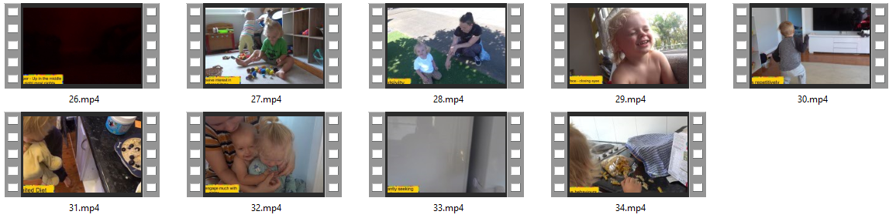
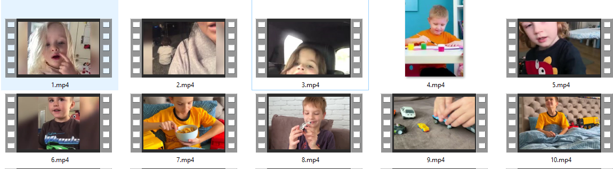

# Safe Autism

## Description
The Main task is to perform both Autistic and Normal kids classes classification we used mp4 dataset videos as inputs into  the  Convolutional neural networks (CNN) Model.
Using this project, we are able to identify when a child is autistic from an early age. 

## The dataset
The [dataset](https://drive.google.com/drive/folders/1N-bNh1waxe3KTS5tPWTKNeDPlOXQ48FU?fbclid=IwAR1y9WJhDdMRE7ww1fHCluh2BvqD4DVpdH1NnhKpuT2JjgKDDKtEAna12wQ) contains trials performed by both autistic  and normal Kids.

#### Example of autistic kids.

#### Example of normal kids.

## License
This repository is released under the MIT LICENSE.
